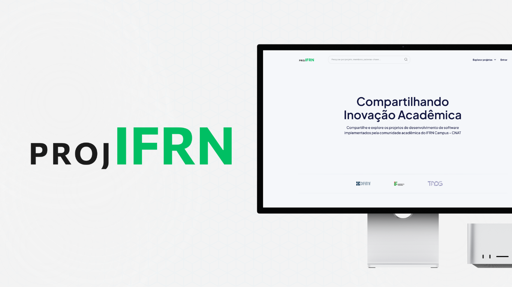

# ProjIFRN
ProjIFRN é uma plataforma que facilita o compartilhamento de projetos na comunidade acadêmica.

## 👥 Equipe e Contatos

1. Antônio Fernandes da Cruz Junior - cruz.junior@escolar.ifrn.edu.br
2. Davi Alessandro Canuto da Silva Gregório - davi.gregorio@escolar.ifrn.edu.br
3. Debora Lavínia da Silva Melo - melo.debora@escolar.ifrn.edu.br
4. Neemias Renan Santos de Oliveira - neemias.renan@escolar.ifrn.edu.br
5. Wagner Amadeus Galvão de Souza - amadeus.galvao@escolar.ifrn.edu.br

## 📅 Horário de Reuniões

- **Quartas-feiras:** Reunião com o orientador no campus.
- **Segundas-feiras, Sextas-feiras e Sábados:** Reunião da equipe no Discord.

## 🛠️ Tecnologias e Ferramentas Utilizadas

- **Node:** Ambiente de execução para JavaScript do lado do servidor.
- **Vue.js:** Framework progressivo para construção de interfaces de usuário.
- **LucidChart e Astah:** Ferramentas de criação de diagramas e fluxogramas.
- **VsCode:** Editor de código-fonte altamente configurável.

## 📚 Documentação

1. [Documento de visão](doc/visao/doc-visao.md)
2. [Mapa do site](doc/mapa-site/mapa-site.md)
3. [Protótipos de interface com o usuário](doc/prototipos/prototipos.md)
4. [Modelo de Domínio](doc/dominio/dominio.md)
5. [Modelo de casos de uso](doc/cdu/cdu.md)
6. [Glossário](doc/visao/glossario.md)
7. [Prioridades dos Casos de Uso](doc/visao/lista_CDU.md)

## 🛠️ Manual do Desenvolvedor

Para começar a contribuir com o projeto, siga os passos abaixo:

1. Clone o repositório:
   ```bash
   git clone https://github.com/tads-cnat/ProjIFRN.git
   ```

2. Verifique se o Python está instalado em sua máquina:
   ```bash
   python --version
   ```

3. Navegue até o diretório clonado:
   ```bash
   cd ProjIFRN
   ```

4. Crie um ambiente virtual:
   ```bash
   python -m venv venv
   ```

5. Ative o ambiente virtual:
   - Windows:
     ```bash
     venv\Scripts\activate
     ```
   - Linux/Mac:
     ```bash
     source venv/bin/activate
     ```

6. Instale as dependências:
   ```bash
   pip install -r requirements.txt
   ```

7. Crie o banco de dados:
   ```bash
   python manage.py migrate
   ```

8. (Opcional) Crie um superusuário:
   ```bash
   python manage.py createsuperuser
   ```

9. Inicie o servidor:
   ```bash
   python manage.py runserver
   ```

Agora você está pronto para começar a desenvolver para o ProjIFRN!


