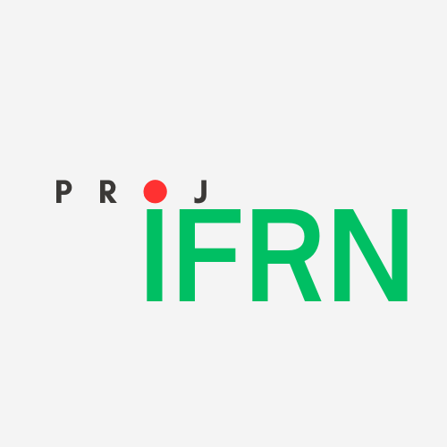

# ProjIFRN

Uma plataforma que possibilita a comunidade acadêmica compartilhar projetos

# Equipe e Formas de Contato

1. Antônio Fernandes da Cruz Junior
2. Debora Lavínia da Silva Melo
3. Lucas Nithael Silva de Souza
4. Vinicius Vasconcelos Ferreira Soares
5. Wagner Amadeus Galvão de Souza

# Contatos
1. cruz.junior@escolar.ifrn.edu.br
2. melo.debora@escolar.ifrn.edu.br
3. lucas.nithael@escolar.ifrn.edu.br
4. soares.vinicius@escolar.ifrn.edu.br
5. amadeus.galvao@escolar.ifrn.edu.br

# Horário de Reuniões

- **Quartas-feiras:** reunião com o orientador no campus
- **Segundas-feiras, Sextas-feiras e Sábados:** reunião da equipe no discord 

# Tecnologias Utilizadas

- Python
- LucidChart
- VsCode
- Word

# Documentação

[Link para os documentos do projeto](doc/documentacao.md)

# Manual da Desenvolvedor

## Clona o projeto
1. No terminal do seu computador digite para clonar: `git clone <url do repositório>`
2. Verifique se python está instalado na sua máquina: `python --version`
3. Entre no diretório que clonou o repositório: `cd <caminho do diretório>`
4. Crie um ambiente virutal: `python -m venv venv`
5. Ative o ambiente virtual: **windows** - `venv\Scripts\activate` , **linux/mac** - `source venv/bin/activate`
6. Crie o banco de dados: `python manage.py migrate`
7. (Opcional) Crie um superusuário: `python manage.py createsuperuser`
8. Inicie o servidor: `python manage.py runserver`
