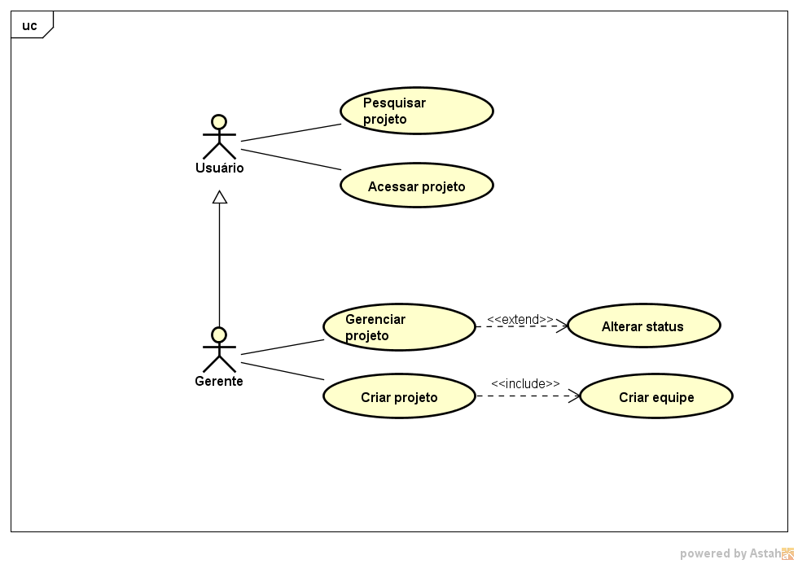

# Modelo de Casos de Uso

## 1. Diagrama de Casos de Uso

## 2. Listagem dos detalhamentos dos casos de uso

1. [CDU-001 - Pesquisar projeto](cdu-001/detalhamento-001.md)
2. [CDU-002 - Visualizar projeto](cdu-002/detalhamento-002.md)
3. [CDU-003 - Visitar perfil](cdu-003/detalhamento-003.md)
4. [CDU-004 - Alterar informações pessoais](cdu-004/detalhamento-004.md)
5. [CDU-005 - Cadastrar conta](cdu-005/detalhamento-005.md)
6. [CDU-010 - Gerenciar projeto](cdu-010/detalhamento-010.md)
7. [CDU-011 - Definir equipe](cdu-011/detalhamento-011.md)
8. [CDU-012 - Definir gerente](cdu-012/detalhamento-012.md)
9. [CDU-013 - Gerenciar categoria](cdu-013/detalhamento-013.md)
10. [CDU-014 - Alterar status](cdu-014/detalhamento-014.md)
11. [CDU-015 - Adicionar administrador](cdu-015/detalhamento-015.md)
12. [CDU-016 - Criar projeto](cdu-016/detalhamento-016.md)
